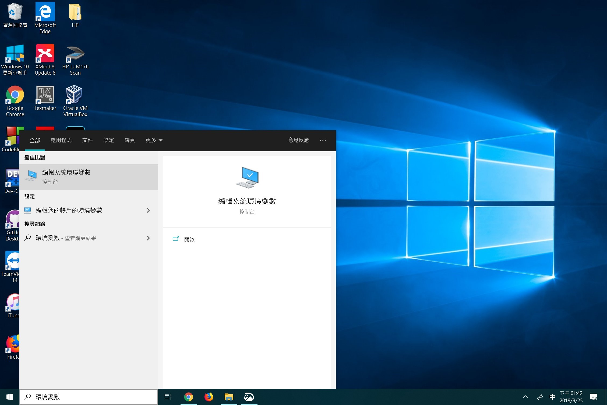

# 0.1 Introduction to Python

> ## Python is powerful... and fast; plays well with others; runs everywhere; is friendly & easy to learn; is Open.

Python 官方網站 ： [https://www.python.org](https://www.python.org/)

## Python 小歷史

* 創始人 Guido van Rossum 是一位荷蘭程式設計師，在1989年的聖誕節期間，開發了Python程式語言，作為ABC語言的繼承。
* Python 2.0 於 2000年10月16日發布
* Python 3.0 於 2008年12月3日發布

